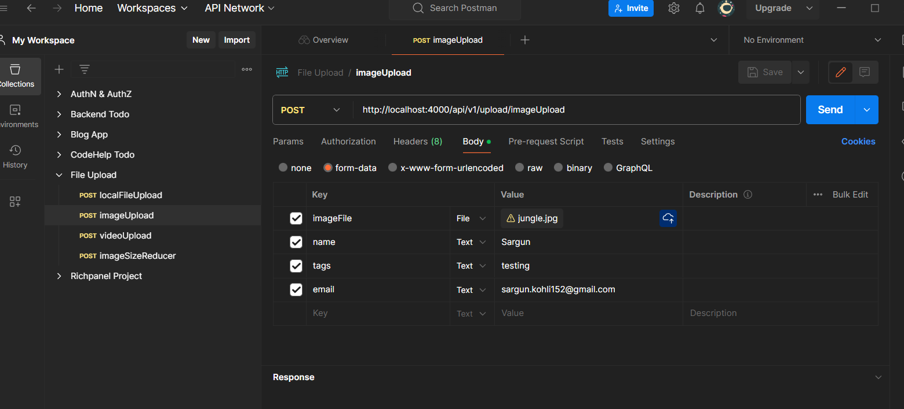
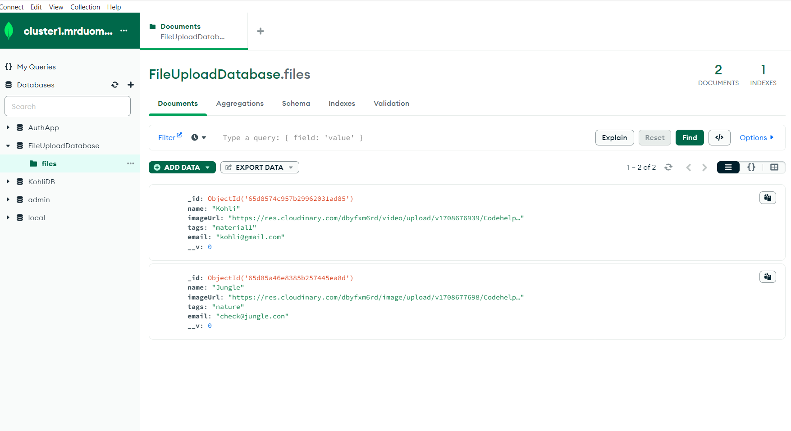
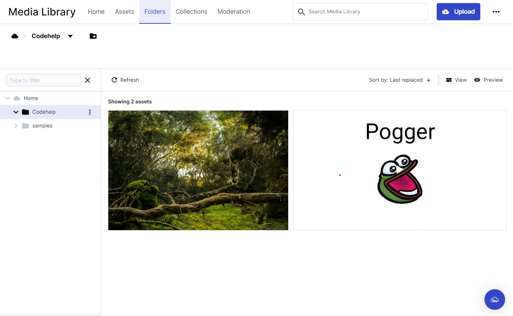
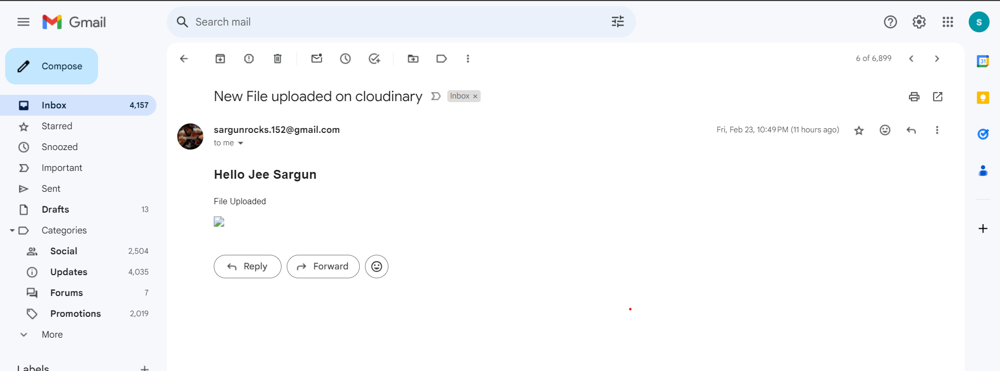

# Media Upload Backend

This Node.js and Express.js backend project provides a versatile API for uploading images and videos. The backend application also sends an auto-generated email notification to the user after successful uploading of media. MongoDB Atlas is used as the database, and Postman can be utilized to test the API routes.






## Features

- **Local File Upload:**
  - Route: `http://localhost:4000/api/v1/upload/localFileUpload`
  - Uploads or moves a file to the chosen directory of the developer. Allows files of any extension.

- **Image Upload:**
  - Route: `http://localhost:4000/api/v1/upload/imageUpload`
  - Uploads an image file to the database and the developer's Cloudinary account and chosen folder. Allows files of jpg, jpeg, and png extensions only.

- **Video Upload:**
  - Route: `http://localhost:4000/api/v1/upload/videoUpload`
  - Uploads a video file to the database and the developer's Cloudinary account and chosen folder. Allows files of mp4 and mov extensions only.

- **Image Size Reducer:**
  - Route: `http://localhost:4000/api/v1/upload/imageSizeReducer`
  - Compresses the size of an image and then uploads the image file to the database and the developer's Cloudinary account and chosen folder. Allows files of jpg, jpeg, and png extensions only.

## Technology and Dev Tools Used:
 - node.js
 - express.js
 - nodemailer
 - cloudinary api
 - mongodb compass
 - postman 

## Middleware

- **Email Notification:**
  - Upon successful saving of the user's entry into the database, a post-middleware sends an email to the user's provided email address using Nodemailer.

## Environment Variables

Ensure to set the following environment variables for proper functionality:
1. `MONGODB_URL`: MongoDB Atlas link.
2. `CLOUD_NAME`, `API_KEY`, `API_SECRET`: Cloudinary account information.
3. `MAIL_USER`, `MAIL_PASS`: Mailing user ID and auto-generated password for Nodemailer.

## Getting Started

1. Clone the repository

2. Install dependencies:
   ```bash
   npm install
   ```
3. Set environment variables in a .env file.

4. Start the server:
   ```bash
   npm run dev
   ```

## Testing API Routes
Use Postman or any API testing tool to interact with the following routes:

 - Local File Upload: 
   ```bash
   POST http://localhost:4000/api/v1/upload/localFileUpload
   ```
 - Image Upload: 
   ```bash
   POST http://localhost:4000/api/v1/upload/imageUpload
   ```
 - Video Upload: 
   ```bash
   POST http://localhost:4000/api/v1/upload/videoUpload
   ```
 - Image Size Reducer and Uploader: 
   ```bash
   POST http://localhost:4000/api/v1/upload/imageSizeReducer
   ```

## Contributing

Thank you for considering contributing to the Media Upload Backend! Contributions help improve the project and make it better for everyone.

To contribute, follow these steps:

1. Fork the repository.
2. Create a new branch for your feature or bug fix:
   ```bash
   git checkout -b feature/your-feature
   ```
   or 
    ```bash
    git checkout -b bugfix/your-bugfix
    ```
3. Make your changes, commit them, and push to your fork:
   ```bash
    git add .
    git commit -m 'Your descriptive commit message'
    git push origin feature/your-feature
   ```

4. Open a Pull Request (PR) on the original repository.
    - Provide a detailed description of your changes in the PR.
    - Reference any relevant issues or related PRs.
5. Your PR will be reviewed, and once approved, it will be merged into the main branch.

## License
This project is licensed under the MIT License.
